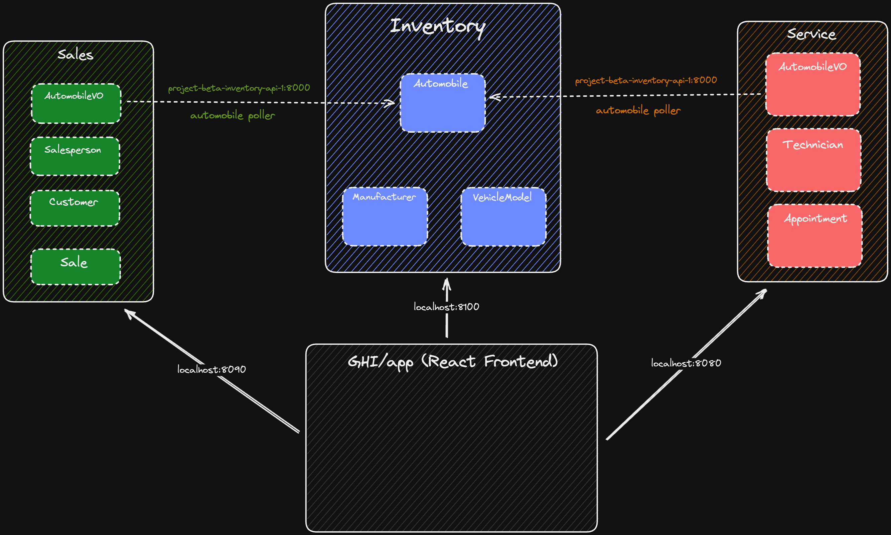
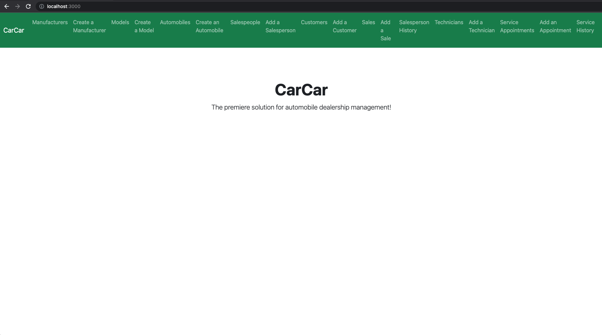

# CarCar

Team:

* Shahem Al Hadid - Sales
* Ryan Curry - Service

## Design

We used domain driven design to build microservices. We have an inventory microservice, a sales microservice and a service microservice that allow us to manage our inventory, sales, customer and employee data. We used REST APIs for each microservice. We integrated the React framework to build a frontend UI to allow users to interact(create, read, delete) with our application and manage their inventory. We used docker containers to manage each service.

### Project Architecture Diagram

## Service microservice

Created two (2) models (Technician, Appointment) and 1 value object (AutomobileVO). The automobile value object links appointments to the automobile inventory microservice to determine if the automobile was purchased at the dealership. If the automobile was purchased at the dealership, these customers get a VIP status at the service center when they make an appointment. From a technical perspective, when an automobile is added to inventory, an automobile value object is created in our service microservice database which is then used to link the automobile to to an appointment. Our Technician and Appointment models allow us to store the respective data in our databases. The Technician model allows us to manage our technicians. The Appointment model allows us to manage service appointments, including assigning technicians and prioritizing VIP customers. The technician property in the Appointment model is protected on delete to avoid deleting the technician when an Appointment is deleted.

### The Service API

The Service Center API comes with RESTful endpoints for the following entities:

- Technician: The technicians who work in the service center
- Appointment: Service appointments for automobiles and their owners.

Service API Base URL: `http://localhost:8080/`

Port: 8080

#### Technicians

From Insomnia and your browser, you can access the technician endpoints at the following URLs.

| Action | Method | URL |
| ------ | ------ | --- |
| List technicians | GET | http://localhost:8080/api/technicians/ |
| Create a technician | POST | http://localhost:8080/api/technicians/ |
| Delete a specific technician | DELETE | http://localhost:8080/api/technicians/:id/ |
| Get a specific technician | GET | http://localhost:8080/api/technicians/:id/ |

#### Appointments

From Insomnia and your browser, you can access the appointment endpoints at the following URLs.

| Action | Method | URL |
| ------ | ------ | --- |
| List appointments | GET | http://localhost:8080/api/appointments/ |
| Create an appointment | POST | http://localhost:8080/api/appointments/ |
| Delete an appointment | DELETE | http://localhost:8080/api/appointments/:id/ |
| Get a single appointment | GET | http://localhost:8080/api/appointments/:id/ |
| Set appointment status to canceled | PUT | http://localhost:8080/api/appointments/:id/cancel/ |
| Set appointment status to finished | PUT | http://localhost:8080/api/appointments/:id/finish/ |

### Models

There are three (3) models included in the Service API:

1. Technician (Entity)
   1. `id` (int, primary key)
   2. `first_name` (str)
   3. `last_name` (str)
   4. `employee_id` (str, unique)

2. Appointment (Entity)
   1. `id` (int, primary key)
   2. `created` (datetime)
   3. `updated` (datetime)
   4. `date_time` (datetime): the date and time of the appointment
   5. `reason` (str)
   6. `vin` (str)
   7. `customer` (str)
   8. `vip_status` (bool)
   9. `status` (str): status of the service appointment (CREATED, FINISHED, CANCELED)
   10. `technician` (object, foreign key)

3. AutomobileVO (Value Object)
   1. `vin` (str)

NOTE: The AutomobileVO gets the `vin` from the Inventory Automobile Information endpoint using a poller found in the `poll` directory under the `service` directory. It pulls data from http://project-beta-inventory-api-1:8000/api/automobiles/ every 60 seconds.

### Frontend Components

1. Add a Technician Form
2. Technicians List
3. Create a Service Appointment
4. List Service Appointments (Active)
5. Service Appointment History (All Service Appointments)

## Sales microservice

Created 3 models(Salesperson, Customer, and Sale) and 1 value object(automobile). The automobile value object links our sales to an automobile in our inventory microservice. Whenever an automobile is assigned to a sale, an automobile value object is created in our sales microservice database as a column in the table to link the automobile to the sale. Our salesperson, customer, and sale models allows us to save the respective data in our databases. The salesperson model allow us to input and our salespeoples' names while also creating and assigning a unique employee id to each employee. Our customer model allows us to create a database of all our customers' names, addresses, and phone numbers. The sale model has an automobile property that is there to link the automobile value object to an automobile in our inventory microservice. The salesperson and customer properties in our sales model grabs data from our salesperson and customer models and links them to a specific sale. We protected salesperson and customer properties on delete to avoid deleting the respective data when a sale is deleted and also to protect against deleting a salesperson or a customer that have already been assigned to a sale.

## How to Run the Application

These instructions assume you have [docker](https://www.docker.com/get-started/) installed on your computer.

STEP 1: Clone the main branch of this repository to your local computer in a directory of your choosing using the HTTPS link.

    git clone https://gitlab.com/smalhadid/project-beta.git

STEP 2: cd into the newly created `project-beta` directory

    cd project-beta

STEP 3: Create a volume in docker for the database

    docker volume create beta-data

STEP 4: Create the docker images using docker compose

    docker-compose build

STEP 5: Run the docker containers from the newly created images using docker compose

    docker-compose up

STEP 6: As the docker containers are initializing, open a browser and in the URL, go to:

    http://localhost:3000

This should bring you to either a blank page if the docker containers are not loaded yet (it takes about a minute) or the main page of the application, which should look like this:

Now you are ready to test the application through the React frontend. Start clicking on the navigation links in the green bar to start working with the application. Enjoy!

### Stopping the Containers

From the terminal: Press `control+C` to stop the docker containers in the terminal session where the containers are running (MacOS)

Or you can stop the containers from the [Docker Desktop Application](https://www.docker.com/products/docker-desktop/)

### Removing the Containers

If you want to free up some space on your computer you can remove the containers with this command (make sure to stop them first):

    docker container prune -f

